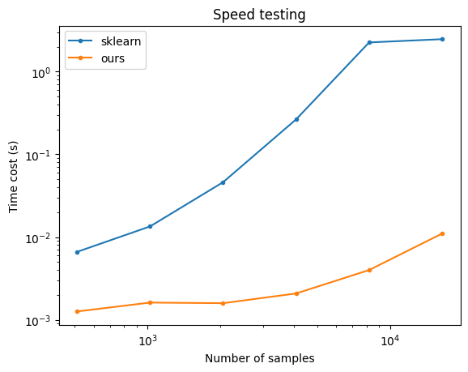

# pytorch_silhouette

 A Pytorch implementation of the Silhouette score.

## Related Links

1. https://scikit-learn.org/stable/modules/generated/sklearn.metrics.silhouette_score.html

2. https://github.com/KevinMusgrave/pytorch-adapt/blob/1366df7c020e3fbc4a44f4f35c13cfcc76334868/src/pytorch_adapt/layers/silhouette_score.py#L4

## sklearn vs ours

More details are in `pytorch_silhouette.ipynb`.

